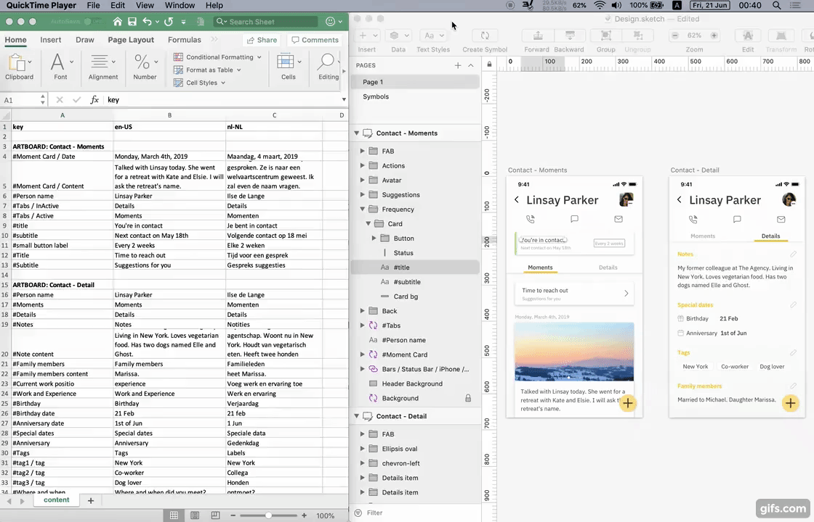

# sketchExcelTranslate

Decouple and Sync multi-language content between Sketch and Excel.

## Use cases
- Decouple your content from Sketch so you can hand-off your content for review by a copy-writer
- Switch easily between multiple languages
- Switch easily between multiple versions of your content

## Usage

- Backup your Sketch file (just in case)
- Prefix your text layers and/or symbol layers that you want to include with '#'
- Generate Excel file with all your content: Plugins -> Excel Translate -> Generate Content File...
- Select the Content File: Plugins -> Excel Translate -> Select Content File...
- Select your language
- Wait till your Sketch file is updated.

## How many language are supported
- As many as you want. Each columnn in your Excel file can be chosen as a language source.

## What about symbol overrides
- Symbol overrides are supported. Prefix your symbols with '#' to include them. The will be listed as 'symbolName / overrideName' in the Excel file.
- Same applies to symbols within symbols.

## Get involved
- Accepting bug fixes, feature requests, PRs.
- This is my first Sketch plugin, and I'm happy to review PRs regarding code improvements and best practices.
- See SKPM on how to get started.